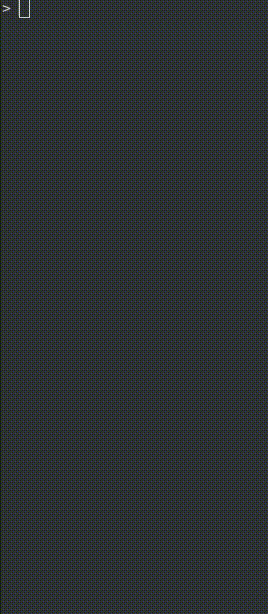

# simple_sudoku

[Backtracking](https://en.wikipedia.org/wiki/Backtracking) sudoku solver.

A sudoku board is described as a list of lists. Zeros represent empty squares.

```python
board=[
    [9, 0, 0, 7, 0, 0, 0, 0, 0],
    [0, 0, 0, 5, 1, 0, 3, 0, 0],
    [0, 5, 4, 0, 0, 0, 0, 9, 0],
    [0, 7, 0, 0, 3, 1, 0, 8, 5],
    [1, 0, 0, 0, 9, 0, 0, 0, 0],
    [0, 0, 0, 0, 6, 0, 0, 0, 0],
    [0, 0, 0, 0, 0, 8, 9, 0, 6],
    [7, 2, 0, 0, 0, 0, 0, 0, 0],
    [0, 0, 0, 0, 0, 2, 0, 0, 3]
]
```

### example

